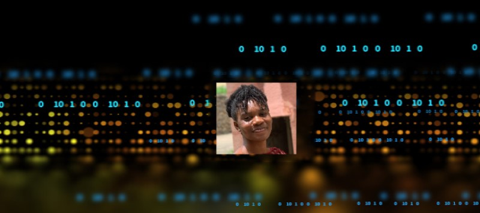

<h1 align="center">Hi 👋, I'm Elizabeth Afolabi</h1>
<h3 align="center">A frontend developer, still learning😃</h3>

- 🌱 I’m currently learning **React and vite**

- 👨‍💻 All of my projects are available at [https://betty-portfolio.netlify.app/](https://betty-portfolio.netlify.app/)

- 📫 How to reach me **betty4web@gmail.com**

- ⚡ Fun fact **I love animals and nature😊**

<h3 align="left">Connect with me:</h3>

<h3 align="left">Languages and Tools:</h3>

    <a href="https://reactjs.org/" target="_blank" rel="noreferrer"> 

&nbsp;

